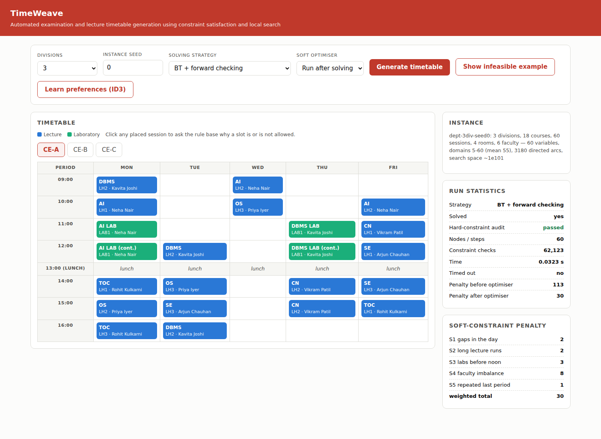

# TimeWeave

**Automated examination and lecture timetable generation using constraint satisfaction and local search.**

Artificial Intelligence (702CO0C076) — B.Tech Computer Engineering, MPSTME, SVKM's NMIMS
Shlok Patel (B281) · Khush Patel (B284)

---

## What it does

Departmental timetabling is done by hand in spreadsheets, and clashes usually surface only
after the timetable is published. TimeWeave models the whole task as a Constraint Satisfaction
Problem, solves it with seven different AI techniques, compares them on identical instances,
and — when no timetable exists — says exactly which constraints are fighting each other.

```
pip install -r requirements.txt

python scripts/demo.py              # a full tour: solve, explain, learn, optimise
python scripts/run_benchmark.py     # the results table and charts
python scripts/calibrate.py         # how the instance difficulty was chosen
python scripts/make_report.py       # regenerate the report from the results
python -m pytest tests -q           # 31 tests
python app.py                       # web interface on http://127.0.0.1:5000
```

No CSP or optimisation library is used anywhere. Every algorithm is written from scratch —
that is the deliverable.

---

## The model

| | |
|---|---|
| **Variables** | one per teaching session (`AI-CE-A-L1`, `DBMS-CE-B-P1`, …) |
| **Domains** | every legal `(day, period, room)` triple for that session |
| **Constraints** | seven hard clash rules, five weighted soft preferences |

A five-division instance has 100 variables with roughly 100 values each — a search space
around 10^190.

### Hard constraints

| | Rule | Enforced as |
|---|---|---|
| H1 | No faculty member is in two places at once | binary constraint |
| H2 | No division attends two sessions at once | binary constraint |
| H3 | No room hosts two sessions at once | binary constraint |
| H4 | Room capacity ≥ division strength; labs only in labs | compiled into the domain |
| H5 | Faculty are scheduled only when available | compiled into the domain |
| H6 | Each course meets its weekly quota exactly | structural — one variable per required session |
| H7 | The lunch period is free for every division | compiled into the domain |

Unary constraints are compiled away into the domains rather than tested at every node,
which is what a real solver does. `timeweave/rules.py` derives the *same* restrictions
declaratively so they can be explained in English, and `tests/test_knowledge_layer.py`
asserts the two routes agree on every session.

### Soft constraints

S1 gaps in a division's day · S2 more than two consecutive lectures · S3 labs before noon ·
S4 faculty load imbalance across the week · S5 the same course repeatedly in the last period.

Each carries a weight; their weighted sum is what the optimiser and the genetic algorithm
minimise. The weights are guesses — which is why the ID3 learner exists (below).

---

## The nine techniques

| Module | Technique | Syllabus |
|---|---|---|
| `solvers.py` | Naive backtracking | Unit 2, 4 |
| `solvers.py` | MRV + degree tie-break + LCV ordering | Unit 4 |
| `solvers.py` | Forward checking | Unit 4 |
| `csp.py`, `solvers.py` | AC-3, as preprocessing and maintained during search (MAC) | Unit 4 |
| `solvers.py` | Conflict-directed backjumping | Unit 4 |
| `solvers.py` | Min-conflicts with sideways moves and random restarts | Unit 2, 4 |
| `solvers.py` | Genetic algorithm (tournament, uniform crossover, swap mutation) | Unit 2 |
| `rules.py` | Forward-chaining rule base + explanation facility | Unit 3, 6 |
| `learning.py` | ID3 decision tree over accept/reject feedback | Unit 5 |

Every solver implements one interface:

```python
result = solver.solve(csp, Budget(seconds=20))
result.assignment   # list of (day, period, room), or None
result.stats        # nodes, constraint checks, seconds, penalty
```

which is what makes the comparison fair — the harness cannot accidentally give one
technique an easier problem than another.

---

## Results

`python scripts/run_benchmark.py` runs every solver on five instances (1–5 divisions)
across three seeds, re-checks each returned timetable against all seven hard constraints,
and writes `results/`:

* `benchmark.csv` — one row per (instance, seed, solver)
* `summary.txt` — the table for the report
* four charts — nodes, runtime, success rate, soft penalty

The headline finding is the gap between naive backtracking and anything with inference.
On instances where naive backtracking exhausts a two-million-node budget without finding
anything, forward checking finds a valid timetable in exactly *n* nodes — one per variable,
no backtracking at all. Constraint propagation is not a marginal optimisation here; it is
the difference between solving the problem and not.

Min-conflicts is the fastest route to a *good* timetable but can never prove infeasibility.
The genetic algorithm produces the lowest soft-constraint penalties on small instances and
fails to reach hard feasibility on the largest ones. Both results are in the table.

A caveat worth stating: LCV is the one heuristic that does not pay for itself. Ordering
values by how many options they remove costs more per node than it saves in nodes, so it
expands *more* nodes per second than plain MRV. Implemented naively it dominated the runtime
entirely; `_order_values` indexes each neighbour's domain by the cells it occupies to make
it affordable, and it is still not a win.

---

## Explaining infeasibility

Most timetabling code answers "no solution". A coordinator needs to know *why*.

**Counting arguments** (`explain.necessary_conditions`) prove impossibility with no search
at all: *"Meera Gupta (F1) owes 10 periods a week but is available for only 2."*

**QuickXplain** (Junker, 2004) finds a minimal set of relaxable constraints whose removal
restores feasibility:

```
No timetable exists.
Proved by counting, without any search:
  - Meera Gupta (F1) owes 10 periods a week but is available for only 2.
Minimal set of constraints in conflict:
  - Meera Gupta (F1) is unavailable on Tue
  - Meera Gupta (F1) is unavailable on Wed
  - Meera Gupta (F1) is unavailable on Thu
```

The feasibility oracle behind it is a *budgeted* search, so it is incomplete: a search that
finds nothing has not proved anything. Rather than pretend otherwise, results are cached,
every negative answer requires both a complete search and a min-conflicts pass to fail, a
verification step drops any redundant member, and the report says `proven_minimal` only when
no call hit its budget. The first version of this code shipped a non-minimal conflict set;
`test_quickxplain_returns_a_minimal_conflict` is the test that caught it.

---

## Learning what the coordinator actually wants

The five soft weights are guesses. Instead of asking a coordinator to tune five numbers,
TimeWeave shows them timetables, records accept/reject, and runs ID3 — entropy and
information gain, written out in `learning.py` — over the discretised violation counts.

```
[S4_faculty_balance]  gain=0.463, n=210
    low: [S1_gaps]  gain=0.714, n=107
        low:    -> accept  (n=52)
        medium: -> accept  (n=34)
        high:   -> reject  (n=21)
    medium: [S1_gaps]  gain=0.949, n=38
        ...
    high: -> reject  (n=65)

test accuracy 100.0%
Learned weights: S1_gaps=4.0, S4_faculty_balance=8.0, others=0.5
```

The tree is turned back into weights — features the tree splits on first get the largest
weight, features it never uses are damped — and the soft optimiser re-runs against them.
`scripts/demo.py` step 8 shows the penalty falling while every hard constraint still holds.

The `coordinator_policy` function is a stand-in for real accept/reject clicks so the module
runs end to end today; swap it for a CSV of real decisions and nothing else changes.

---

## The report

`docs/TimeWeave_Project_Report.docx` is the full project report — problem formulation, the
literature review, every algorithm with pseudocode, the results analysis and the limitations.
It is **generated from `results/benchmark.csv`**, not typed: `scripts/make_report.py` reads the
measured results and writes `docs/REPORT.md`, and `scripts/build_report_docx.js` renders that
to Word with the charts embedded. Re-run the benchmark and regenerate, and every number in the
prose moves with it.

## The interface



Pick a size, a seed and a strategy; the grid shows one division at a time with laboratory
sessions spanning their two periods. The right-hand column reports the run — including the
**hard-constraint audit**, which re-checks the returned timetable independently of the search
that produced it — and the soft penalty broken down by constraint. Clicking a session asks the
rule base to explain a slot, and *Show infeasible example* runs the counting argument and
QuickXplain on an over-constrained department.

**Watch the search** replays the solver's own trace into the grid — sessions appear as they are
assigned, disappear when a branch is undone, and a line underneath narrates each step ("assign
DBMS-CE-B-L3 → Wed 16:00 in LH2 · depth 13/40 · 12 values were left in its domain"). Every
solver is instrumented, so you can watch naive backtracking thrash and forward checking walk
straight down the tree on the same instance. Scrub, pause and speed controls are provided.
Recording is off unless asked for, so it costs the benchmark nothing.

## Why the instances are the size they are

A benchmark only says something in the regime where the techniques differ. `scripts/calibrate.py`
sweeps the difficulty parameter and reports how often each end of the spectrum succeeds:

```
 tightness      unavailability by size   FC solves   naive solves
      0.55      16   13   11    8    5    10/10          7/10
      0.65      19   16   13    9    6    10/10          6/10
      0.75      22   18   15   11    7    10/10          5/10
      0.85      25   21   17   12    8     8/10          2/10
```

Below 0.75 the problem is close to trivial; at 0.85 the instances start being genuinely
infeasible and forward checking fails too. 0.75 is the largest setting where a good solver
still always succeeds — so that is the default, and this table is the reason.

## Layout

```
timeweave/
  model.py         calendar, rooms, faculty, courses, sessions
  csp.py           domain construction, binary constraints, AC-3
  constraints.py   hard-constraint audit, weighted soft penalty
  solvers.py       all seven search strategies + the soft optimiser
  rules.py         forward-chaining rule base and explanation facility
  explain.py       counting arguments and QuickXplain
  learning.py      ID3 over coordinator feedback
  instances.py     generator, difficulty calibration, CSV import/export
  benchmark.py     the harness and the charts
  render.py        text and JSON views of a timetable
app.py             Flask API
web/index.html     the interface
scripts/           demo.py, run_benchmark.py, calibrate.py, make_report.py
tests/             31 tests
results/           benchmark.csv, summary.txt, four charts
docs/              the project report, diagrams, interface screenshots
```

## How the tests are built

The suite does not check that the solvers ran; it checks that what they produced is correct.

* Every solver is run on a solvable instance and its output re-audited against all seven
  hard constraints from scratch — the audit never trusts the search that produced it.
* A deliberately broken timetable must be *caught* by the audit (a test that the test works).
* The rule base and the domain compiler must agree on every session's legal slots.
* AC-3 must never empty a domain on a solvable instance and never grow one.
* QuickXplain's conflict set must be sufficient *and* every member necessary.
* ID3 must recover a known two-feature policy exactly, and generalise to held-out data.
* Solving must not mutate the CSP — a bug that would silently corrupt the benchmark.

## Attribution

Written for the Artificial Intelligence course project. Algorithms follow Russell & Norvig
(4th ed., chapters 3, 4 and 6), Mackworth (1977) for arc consistency, Minton et al. (1992)
for min-conflicts, and Junker (2004) for QuickXplain.
