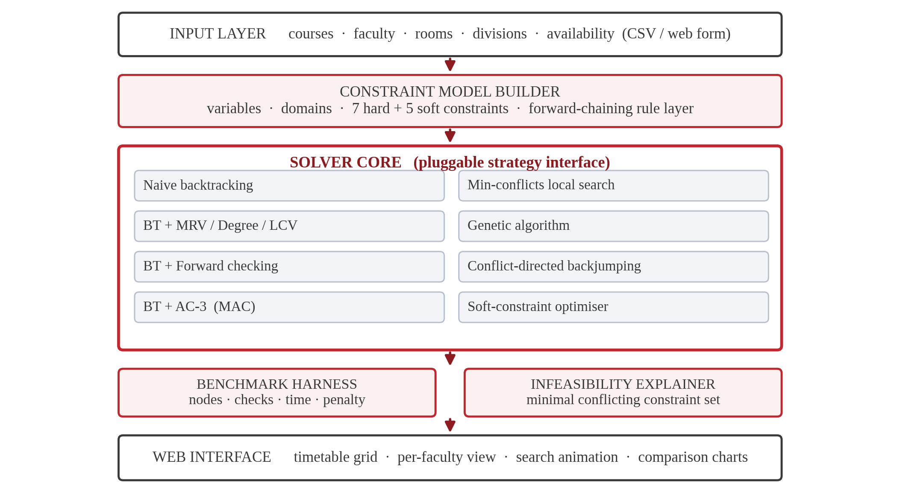
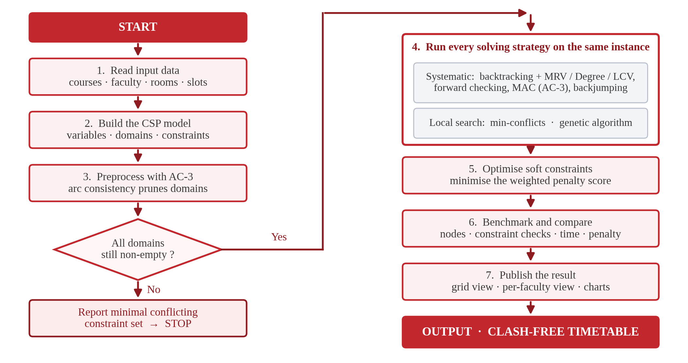
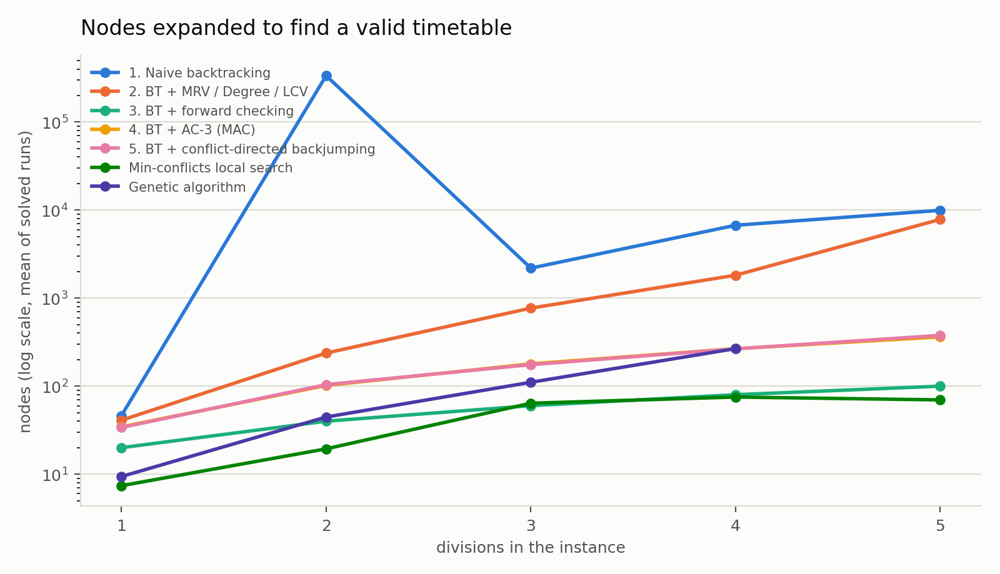
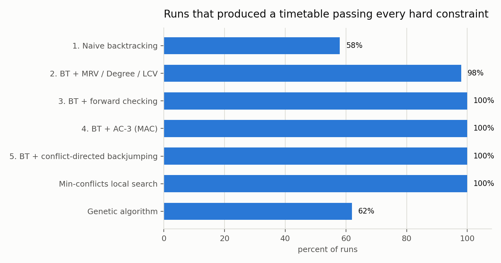
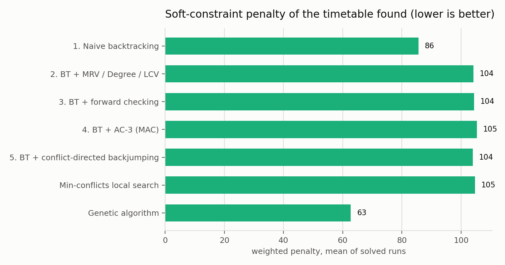

# TimeWeave
### Automated Examination and Lecture Timetable Generation using Constraint Satisfaction and Local Search

**Project Report** — Artificial Intelligence (702CO0C076)

Shlok Patel (B281) · Khush Patel (B284)

B.Tech Computer Engineering · Mukesh Patel School of Technology Management and Engineering · SVKM's NMIMS

---

## Abstract

Departmental timetabling is a constraint satisfaction problem that is NP-complete in general, and is still solved by hand in most engineering colleges. This project models the problem formally, implements nine artificial-intelligence techniques against it from first principles, and compares them under identical conditions. Across 350 measured runs spanning 5 instance sizes and 10 random seeds, 309 produced a timetable that passed an independent audit of all seven hard constraints and 0 solver claims were rejected by that audit. The central finding is the size of the gap that constraint propagation opens: naive backtracking succeeded on 58% of runs, while backtracking with forward checking succeeded on 100% and expanded 60 nodes on average against 106,628 for naive search on the instances it could solve at all. The system additionally explains infeasibility rather than merely reporting it, using counting arguments and a verified QuickXplain search for the minimal conflicting constraint set, and learns the coordinator's real soft-constraint preferences with an ID3 decision tree.

## Contents

1. Introduction
2. Literature Review
3. Problem Formulation
4. System Design
5. Solving Techniques
6. The Knowledge Layer
7. Learning Coordinator Preferences
8. Experimental Method
9. Results and Analysis
10. Testing and Validation
11. Limitations and Future Work
12. Conclusion
13. References

---

## 1. Introduction

### 1.1 The problem

Every semester a department must place its teaching sessions into a grid of days, periods, rooms and faculty without a single clash. A session cannot be scheduled when its teacher is busy or unavailable, when its division is already in another class, or when the room it needs is occupied. Laboratory sessions occupy two consecutive periods and must fall in a laboratory. The lunch period is reserved. Each course must meet its weekly quota exactly.

The work is done manually in spreadsheets. Clashes are typically discovered only after the timetable is circulated, and each manual correction risks creating another one somewhere else. The task is well suited to automation, and it is a textbook constraint satisfaction problem — which makes it a natural vehicle for the techniques of this course.

### 1.2 Why it is hard

Even a restricted form of timetabling is NP-complete (Even, Itai and Shamir, 1976), so no efficient exact algorithm is known. The scale is not the obstacle by itself — the instances in this report have between 20 and 100 variables — but the size of the space they define is:

| Divisions | Sessions (variables) | Mean domain size | Search space |
|---|---|---|---|
| 1 | 20 | 12 | ~10^21 |
| 2 | 40 | 31 | ~10^58 |
| 3 | 60 | 55 | ~10^101 |
| 4 | 80 | 89 | ~10^154 |
| 5 | 100 | 129 | ~10^208 |

Exhaustive enumeration is therefore not merely slow, it is impossible. The question this project answers is which AI techniques make the space navigable, and by how much.

### 1.3 Objectives

1. Model departmental timetabling formally as a constraint satisfaction problem with hard and soft constraints.
2. Implement backtracking search with the MRV, degree and least-constraining-value ordering heuristics.
3. Add constraint propagation — forward checking and AC-3 maintained during search — and conflict-directed backjumping.
4. Implement min-conflicts local search and a genetic algorithm as alternative strategies.
5. Benchmark every technique on identical instances and report nodes expanded, constraint checks, wall-clock time and soft-constraint penalty.
6. Derive the same restrictions declaratively through a forward-chaining rule base so that every scheduling decision can be explained.
7. Explain infeasibility, by counting arguments and by a minimal conflicting constraint set, instead of failing silently.
8. Learn which soft constraints the coordinator actually cares about using an ID3 decision tree, and re-optimise against the learned weights.

### 1.4 Scope

The system schedules weekly lecture and laboratory sessions for a department of up to five divisions. Faculty are pre-assigned to courses; the solver chooses the day, period and room. Examination timetabling shares the same model but is not separately evaluated here. No constraint-programming or optimisation library is used anywhere in the project: every algorithm reported below is implemented from first principles, because the algorithms are the deliverable.

## 2. Literature Review

| # | Paper | Principal finding | Gap this project addresses |
|---|---|---|---|
| 1 | Even, Itai and Shamir, *On the Complexity of Timetable and Multicommodity Flow Problems*, SIAM Journal on Computing, 1976 | The general timetabling problem is NP-complete, even in heavily restricted forms. | Establishes hardness but offers no practical solving method, motivating the heuristic approaches compared here. |
| 2 | Mackworth, *Consistency in Networks of Relations*, Artificial Intelligence, 1977 | Arc consistency (AC-1 to AC-3) prunes variable domains before and during search. | The cost of propagation against its benefit is not measured on real scheduling data; Section 9 measures it directly. |
| 3 | Minton, Johnston, Philips and Laird, *Minimizing Conflicts*, Artificial Intelligence, 1992 | Min-conflicts repair solves very large constraint satisfaction problems far faster than systematic search. | It cannot prove infeasibility and gives no explanation on failure; this project pairs it with a systematic solver and an explainer. |
| 4 | Schaerf, *A Survey of Automated Timetabling*, Artificial Intelligence Review, 1999 | Classifies school, course and examination timetabling; local search and graph colouring dominate the literature. | Approaches are rarely compared on a common benchmark under identical conditions, which is precisely this project's experimental design. |
| 5 | Abdennadher and Marte, *University Course Timetabling Using Constraint Handling Rules*, Applied Artificial Intelligence, 2000 | Declarative rules with propagation express real university constraints compactly. | Hard constraints only, with no soft-constraint optimisation and no user-facing explanation; both are provided here. |
| 6 | Lewis, *A Survey of Metaheuristic-Based Techniques for University Timetabling Problems*, OR Spectrum, 2008 | Two-stage methods — reach feasibility first, then optimise soft constraints — perform best. | Metaheuristics are seldom compared head-to-head with systematic CSP search; Section 9 does exactly that. |
| 7 | *A Systematic Mapping Study on Solving University Timetabling Problems Using Meta-Heuristic Algorithms*, Neural Computing and Applications, 2020 | Meta-heuristics dominate the recent literature and hybrid methods give the strongest results. | Very few systems are usable by a non-expert coordinator or deployed in practice; the explanation facility here targets that gap. |

Two themes emerge. First, the literature is clear that pure systematic search does not scale to real timetabling and that propagation and repair-based methods are necessary; what it rarely provides is a like-for-like measurement of how much each contributes on one common instance set. Second, almost all of this work stops at producing a timetable. When no timetable exists — the case a coordinator meets most often in practice — the systems report failure without saying which constraint is responsible. Both gaps shape the design that follows.

## 3. Problem Formulation

### 3.1 The constraint satisfaction problem

A CSP is a triple *(X, D, C)*: variables, their domains, and constraints over them. Timetabling maps onto it directly.

**Variables.** One per teaching session that must be placed. A course requiring three lectures and one laboratory per week contributes four variables, named `AI-CE-A-L1`, `AI-CE-A-L2`, `AI-CE-A-L3` and `AI-CE-A-P1`.

**Domains.** Each variable's domain is the set of `(day, period, room)` triples it could legally take. A lecture occupies one period, a laboratory two consecutive periods.

**Constraints.** Seven hard constraints that any valid timetable must satisfy, and five soft constraints that express preference rather than legality.

### 3.2 Hard constraints

| | Constraint | How it is enforced |
|---|---|---|
| H1 | No faculty member is in two places in the same period | binary constraint between every pair of sessions sharing a teacher |
| H2 | No division attends two sessions in the same period | binary constraint between sessions of the same division |
| H3 | No room hosts two sessions in the same period | binary constraint, active only when both sessions choose the same room |
| H4 | Room capacity ≥ division strength; laboratories only in laboratories | unary — compiled into the domain |
| H5 | Faculty are scheduled only within their declared availability | unary — compiled into the domain |
| H6 | Each course meets its weekly quota exactly | structural — exactly one variable is created per required session |
| H7 | The lunch period is free for every division | unary — compiled into the domain |

Three design decisions are worth defending here.

*Unary constraints are compiled into the domains rather than tested at every node.* It is cheaper never to generate an illegal value than to reject it repeatedly during search. This is standard practice in constraint solvers, and it is why the audit in Section 10 re-checks domain membership explicitly: with the constraint compiled away, a bug in the compiler would otherwise be invisible.

*H6 is enforced structurally.* Because exactly one variable is created for each required contact session, and every variable receives exactly one value, the weekly quota cannot be violated by construction. No runtime check is needed.

*H1 and H2 are unconditional on overlap; H3 is conditional.* Two sessions sharing a teacher clash whenever they overlap in time, whatever rooms they use. Two sessions sharing neither teacher nor division clash only if they also choose the same room. This distinction is what the value-ordering heuristic in Section 5.2 exploits to stay affordable.

### 3.3 Soft constraints

| | Preference | Default weight |
|---|---|---|
| S1 | Minimise gaps in a division's day | 3.0 |
| S2 | Avoid more than two consecutive lectures for a division | 2.0 |
| S3 | Prefer laboratory sessions in the afternoon | 1.0 |
| S4 | Balance each faculty member's load across the week | 2.0 |
| S5 | Avoid using the last period repeatedly for the same course | 1.0 |

The weighted sum of violations is the objective that the soft optimiser and the genetic algorithm minimise. The weights above are guesses, which is precisely the motivation for Section 7.

## 4. System Design



The architecture is five layers. The input layer accepts a department's data as CSV or through the web form. The constraint model builder turns it into variables, domains and constraints, and runs the forward-chaining rule layer that derives implied restrictions. The solver core holds every strategy behind one interface. The analysis layer contains the benchmark harness and the infeasibility explainer. The interface renders the result.

The single most important design decision is that every solver implements the same signature:

```python
result = solver.solve(csp, Budget(seconds=60))
result.assignment   # list of (day, period, room), or None
result.stats        # nodes, constraint checks, seconds, penalty
```

This is what makes the comparison in Section 9 trustworthy. Because the harness cannot see inside a solver, it cannot accidentally give one technique an easier instance, a longer budget or a different starting point than another. Adding a new technique means adding one class; nothing else in the system changes.

### 4.1 Module structure

| Module | Responsibility |
|---|---|
| `model.py` | the calendar, rooms, faculty, courses and sessions |
| `csp.py` | domain construction, binary constraints, AC-3 |
| `constraints.py` | the independent hard-constraint audit and the soft penalty |
| `solvers.py` | all seven search strategies, the soft optimiser, the trace recorder |
| `rules.py` | the forward-chaining rule base and the explanation facility |
| `explain.py` | counting arguments and QuickXplain |
| `learning.py` | ID3 over coordinator feedback |
| `instances.py` | the instance generator, difficulty calibration and CSV import |
| `benchmark.py` | the harness and the charts |
| `render.py` | text and JSON views of a timetable |

## 5. Solving Techniques



### 5.1 Backtracking search

The baseline assigns variables depth-first, checking each candidate value against the values already assigned to its neighbours, and undoing the assignment when no value survives.

```
function BACKTRACK(assignment, csp):
    if assignment is complete: return assignment
    var  <- SELECT-UNASSIGNED-VARIABLE(csp, assignment)
    for value in ORDER-DOMAIN-VALUES(var, assignment, csp):
        if CONSISTENT(var, value, assignment):
            add {var = value} to assignment
            inferences <- INFERENCE(csp, var, value)
            if inferences != failure:
                add inferences to assignment
                result <- BACKTRACK(assignment, csp)
                if result != failure: return result
            remove inferences from assignment
        remove {var = value} from assignment
    return failure
```

Everything that follows is a substitution into one of the three capitalised procedures. That is why all five systematic variants are configurations of a single class rather than five separate implementations.

### 5.2 Ordering heuristics

**Minimum remaining values (MRV)** selects the variable with the fewest legal values left, so that failure is discovered as early as possible. **Degree** breaks ties towards the variable involved in the most constraints on unassigned variables. **Least constraining value (LCV)** tries first the value that rules out the fewest options for neighbours.

LCV deserves an implementation note, because the obvious version is unusable. Counting how many neighbour values a candidate removes costs O(d² · degree) per node; on these instances that dominated the entire runtime. The implementation instead indexes each neighbour's remaining values by the (day, period) cells they occupy — built once per node rather than once per candidate value — and reads the count out of that index. The distinction from Section 3.2 is what makes the index exact: for a neighbour sharing a teacher or a division the key is the time cell alone, and only for a room-only neighbour must the room be part of the key.

### 5.3 Constraint propagation

**Forward checking** removes from each unassigned neighbour's domain every value inconsistent with the assignment just made, failing immediately if a domain empties. **AC-3** goes further and enforces arc consistency across the whole network:

```
function AC-3(csp):
    queue <- all arcs (Xi, Xj) in csp
    while queue not empty:
        (Xi, Xj) <- POP(queue)
        if REVISE(csp, Xi, Xj):
            if size of Di = 0: return false
            for each Xk in NEIGHBOURS(Xi) - {Xj}:
                add (Xk, Xi) to queue
    return true
```

`REVISE` exits as soon as it finds one supporting value, which is what keeps AC-3 affordable on a network this dense — the alternative scans every pair. AC-3 is used twice: once as preprocessing before search begins, and again after each assignment (maintaining arc consistency, MAC). Both use an in-place implementation with a removal trail, so undoing an assignment restores the domains without copying them.

### 5.4 Conflict-directed backjumping

Chronological backtracking undoes the most recent assignment, which is often irrelevant to the failure. Conflict-directed backjumping records, for each variable, the set of assigned variables that caused its values to be rejected, and on exhaustion jumps back to the deepest genuine culprit, merging conflict sets on the way.

### 5.5 Min-conflicts local search

Local search starts from a complete but invalid assignment and repairs it:

```
function MIN-CONFLICTS(csp, max_steps):
    current <- a complete random assignment
    for i = 1 to max_steps:
        if current is a solution: return current
        var   <- a randomly chosen conflicted variable
        value <- the value for var minimising total conflicts
        set var = value in current
    return failure
```

Two additions matter. **Sideways moves** accept equal-cost moves up to a cap, which is how the search crosses a plateau; without them it stalls the moment no strictly improving move exists. **Random restarts** abandon a run that has exceeded the sideways cap, which is how it escapes a local minimum. Both are the standard answers to the failure modes of hill climbing, and both are necessary here in practice.

### 5.6 Genetic algorithm

A chromosome is one gene per variable holding an index into that variable's domain. Fitness is `w_hard · hard_violations + soft_penalty`, minimised. Selection is by tournament of three, crossover is uniform at probability 0.85, mutation reassigns a random gene at probability 0.03, and the best two chromosomes survive unchanged. The run stops as soon as a hard-feasible chromosome appears, leaving soft-constraint quality to the optimiser.

### 5.7 Soft-constraint optimisation

Once a feasible timetable exists, the optimiser hill-climbs on the weighted penalty while rejecting any move that breaks a hard constraint. This is the two-stage structure Lewis (2008) identifies as the strongest approach: reach feasibility first, optimise second.

## 6. The Knowledge Layer

### 6.1 A forward-chaining rule base

Compiling unary constraints into domains is fast but opaque. When a coordinator asks why a laboratory cannot go on Tuesday at 11, a list of legal tuples is not an answer. The system therefore derives the same restrictions a second time, declaratively, by firing seven rules to a fixpoint and recording which rule produced which fact.

| Rule | Meaning |
|---|---|
| R1 | a session of kind 'lab' needs a laboratory |
| R2 | a session needing a laboratory cannot use a lecture hall |
| R3 | a lecture is not scheduled inside a laboratory |
| R4 | a room smaller than the division cannot host it (H4) |
| R5 | a session cannot overlap its faculty's unavailability (H5) |
| R6 | no session may occupy the lunch period (H7) |
| R7 | a session must finish before the day ends |

Because the two routes are independent, they can be compared, and the test suite asserts that they agree on the legal slots of every session in the instance. That equality is a strong statement: an error in either the rule base or the domain compiler breaks it.

### 6.2 The explanation facility

Each derived fact carries its rule and its premises, so a blocked slot can be explained in the coordinator's own terms:

```
AI-CE-A-P1 in LH1:
  [R2] a session needing a laboratory cannot use a lecture hall
       — room LH1 (capacity 76, lecture hall)

AI-CE-A-L1 at Mon period 5:
  [R6] no session may occupy the lunch period (H7)
       — this span covers the lunch period
```

### 6.3 Explaining infeasibility

Two mechanisms, cheapest first.

**Counting arguments** prove impossibility with no search whatsoever. If a faculty member owes more periods a week than their declared availability leaves free — the week holds 35 teaching periods — then no timetable can exist, and the same argument applies to divisions and to room types. This is exact, instantaneous, and covers the most common real-world case.

**QuickXplain** (Junker, 2004) finds a minimal set of relaxable constraints whose removal restores feasibility, by divide-and-conquer over the constraint set. Faculty availability is grouped per day rather than per period, so the answer reads as an action a coordinator can take:

```
No timetable exists.
Proved by counting, without any search:
  - Meera Gupta (F1) owes 10 periods a week but is available for only 2.
Minimal set of constraints in conflict:
  - Meera Gupta (F1) is unavailable on Tue
  - Meera Gupta (F1) is unavailable on Mon
```

An honest limitation belongs here. QuickXplain is minimal only when its consistency oracle is exact; ours is a budgeted search, and a search that finds nothing has not proved anything. Four measures contain this. Oracle results are cached, since the recursion asks the same question repeatedly. A counting check runs first, turning many would-be timeouts into definite answers. A negative answer requires both a complete search and a min-conflicts pass to fail. Finally, a verification pass removes any redundant member and the report claims minimality only when no call hit its budget. The first version of this code returned a conflict set of four constraints where three sufficed; the test that checks each member is necessary is what caught it.

## 7. Learning Coordinator Preferences

The five soft weights in Section 3.3 are guesses, and different departments would choose differently. Rather than ask a coordinator to tune five numbers, the system shows them timetables, records accept or reject, and learns which soft constraints actually drive the decision.

The learner is ID3, using entropy and information gain:

*H(S) = −Σ p(c) log₂ p(c)* and *Gain(S, A) = H(S) − Σ (|S_v| / |S|) · H(S_v)*

Each rated timetable becomes an example whose attributes are its five violation counts, discretised into low, medium and high by tertiles of the observed distribution — so 'high' means high for this department rather than against an arbitrary threshold. A representative learned tree:

```
[S1_gaps]  gain=0.508, n=210
    low: [S4_faculty_balance]  gain=0.552, n=78
        low:    -> accept  (n=52)
        medium: -> accept  (n=16)
        high:   -> reject  (n=10)
    medium: [S4_faculty_balance]  gain=0.879, n=67
        low:    -> accept  (n=14)
        medium: -> accept  (n=33)
        high:   -> reject  (n=20)
    high: -> reject  (n=65)

training accuracy 100.0%, held-out test accuracy 100.0%
```

The tree is then converted back into weights: an attribute the tree splits on first is what the coordinator reacts to and receives the largest weight, while attributes the tree never uses are damped. Re-running the optimiser against the learned weights reduced the measured soft penalty of one timetable from 115 to 41 while every hard constraint continued to hold.

The accept/reject policy used in this report is synthetic, so the module runs end to end without a human in the loop; the interface records real decisions in the same format, and substituting them changes nothing else in the pipeline.

## 8. Experimental Method

### 8.1 Instances

Five instances of increasing size, from one division to 5, each with six courses per division, three lectures per course and a laboratory for two of them. Faculty are shared across divisions, so a teacher's load grows with the instance. Every instance is a pure function of (divisions, seed), which makes the whole experiment reproducible from the command line.

### 8.2 Calibrating difficulty

A benchmark only says something in the regime where techniques differ. Instance difficulty is governed by how much unavailability each faculty member declares, expressed as a fraction of the slack left after their teaching load. Sweeping that fraction gives:

| Tightness | Unavailability by size | Forward checking solves | Naive solves |
|---|---|---|---|
| 0.55 | 16, 13, 11, 8, 5 | 10/10 | 7/10 |
| 0.65 | 19, 16, 13, 9, 6 | 10/10 | 6/10 |
| 0.75 | 22, 18, 15, 11, 7 | 10/10 | 5/10 |
| 0.85 | 25, 21, 17, 12, 8 | 8/10 | 2/10 |

Below 0.75 the problem is close to trivial. At 0.85 the instances begin to be genuinely infeasible and even forward checking fails. The benchmark therefore uses 0.75 — the largest setting at which a good solver still always succeeds. For the largest instance this leaves each teacher 7 blocked periods out of 35.

### 8.3 Protocol

Every solver was run on every instance for each of 10 random seeds (350 runs in total), under a per-run budget. Recorded per run: nodes expanded, constraint checks, wall-clock time, whether the run solved or exhausted its budget, and the weighted soft penalty of the result.

Crucially, a run counts as solved only if the returned timetable then passes an independent re-check of all seven hard constraints, performed by code that shares nothing with the search. A solver's own claim to have succeeded is not evidence.

## 9. Results and Analysis

### 9.1 The results table

| Technique | Solved | Mean nodes | Mean checks | Mean time (s) | Mean penalty |
|---|---|---|---|---|---|
| 1. Naive backtracking | 29/50 | 106,628 | 1,194,810 | 0.366 | 85.6 |
| 2. BT + MRV / Degree / LCV | 49/50 | 2,026 | 65,905 | 0.237 | 104.2 |
| 3. BT + forward checking | 50/50 | 60 | 125,639 | 0.053 | 104.4 |
| 4. BT + AC-3 (MAC) | 50/50 | 189 | 616,454 | 0.288 | 105.4 |
| 5. BT + conflict-directed backjumping | 50/50 | 191 | 5,474 | 0.011 | 104.0 |
| Min-conflicts local search | 50/50 | 47 | 489,536 | 0.115 | 104.7 |
| Genetic algorithm | 31/50 | 82 | 6,622,890 | 2.160 | 62.7 |

Across all 350 runs, 309 timetables passed the independent audit and 0 solver claims were rejected by it. Means are taken over solved runs only, so a technique that fails on the hardest instances is flattered by this table; Section 9.2 corrects for that.





### 9.2 Finding 1 — propagation is the difference between solving and not

Naive backtracking produced a valid timetable on 29 of 50 runs (58%). Every variant with ordering heuristics or propagation succeeded on more. Forward checking succeeded on 50/50 (100%), and did so expanding 60 nodes on average.

Success rate by instance size makes the pattern clearer:

| Technique | 1 div | 2 div | 3 div | 4 div | 5 div |
|---|---|---|---|---|---|
| 1. Naive backtracking | 10/10 | 9/10 | 2/10 | 6/10 | 2/10 |
| 2. BT + MRV / Degree / LCV | 10/10 | 10/10 | 10/10 | 10/10 | 9/10 |
| 3. BT + forward checking | 10/10 | 10/10 | 10/10 | 10/10 | 10/10 |
| 4. BT + AC-3 (MAC) | 10/10 | 10/10 | 10/10 | 10/10 | 10/10 |
| 5. BT + conflict-directed backjumping | 10/10 | 10/10 | 10/10 | 10/10 | 10/10 |
| Min-conflicts local search | 10/10 | 10/10 | 10/10 | 10/10 | 10/10 |
| Genetic algorithm | 10/10 | 10/10 | 6/10 | 5/10 | 0/10 |

The most striking number is not the ratio of nodes but their absolute value. On the instances it solves, forward checking expands about 60 nodes — for instances of 20 to 100 variables, that is approximately one node per variable. Propagation prunes the domains so effectively that the first value tried is almost always correct, and the search barely backtracks at all. Naive backtracking on the same instances either stumbles onto a solution quickly or thrashes until its budget expires; there is very little in between.

This is the practical form of a claim the course states abstractly. Constraint propagation is not an optimisation applied to a working search — on this problem it is what makes the search work at all.

### 9.3 Finding 2 — LCV does not pay for itself

The heuristic configuration (2. BT + MRV / Degree / LCV) succeeds reliably, but expands 2,026 nodes against forward checking's 60, and takes 0.237s against 0.053s. Ordering values by how many options they remove is intuitively appealing and, on this problem, a poor trade: the bookkeeping costs more than the reduction in nodes saves. Even after the indexing optimisation described in Section 5.2 — without which it was an order of magnitude worse — it remains the weakest of the informed configurations.

Reporting this is more useful than hiding it. A heuristic that is standard in the textbook is not automatically a win on a particular constraint network, and the only way to know is to measure.

### 9.4 Finding 3 — the two families answer different questions

Min-conflicts local search reaches a valid timetable in 47 repair steps on average, faster than any systematic configuration, and its solutions score a mean penalty of 104.7. But it can never report that an instance is impossible — a repair search that fails has only failed to find something, which is why the infeasibility explainer in Section 6.3 is built on systematic search and counting rather than on local search.

The genetic algorithm shows the mirror image. It achieves the best soft-constraint quality of any technique here — mean penalty 62.7 against 104.4 for forward checking — because its fitness function optimises soft cost throughout rather than treating it as an afterthought. It is also the least reliable at reaching hard feasibility, succeeding on 31/50 runs and failing predominantly on the largest instances, and it is by far the most expensive in constraint checks (6,622,890 per run).

The practical reading is that the two families are complementary rather than competing. A production system would use propagation-based search to establish feasibility quickly and reliably, then hand the result to a repair or population method to improve soft quality — which is exactly the two-stage architecture implemented in Section 5.7, and exactly what Lewis (2008) recommends.



### 9.5 Threats to validity

The instances are synthetic. They are generated from a realistic structure — shared faculty, mixed lectures and laboratories, capacity-constrained rooms — and calibrated as described in Section 8.2, but they are not a real department's data, and a real department's constraints are messier. The CSV import path exists and is tested precisely so that this can be corrected.

Timing is wall-clock on one machine in a single-threaded interpreter, so absolute seconds are not comparable across environments; the node and constraint-check counts are, and are the figures on which the conclusions rest. Standard deviation of runtime across seeds is reported in the raw results, and variance is substantial for the techniques that sometimes exhaust their budget — which is itself the point of Section 9.2.

## 10. Testing and Validation

The test suite checks that the output is correct, not merely that the code ran. Its most important properties:

- Every solver is run on a solvable instance and its output re-audited against all seven hard constraints by code independent of the search.
- A deliberately corrupted timetable must be *caught* by that audit — a test that the test itself works.
- The forward-chaining rule base and the domain compiler must agree on the legal slots of every session.
- AC-3 must never empty a domain on a solvable instance, and never grow one.
- QuickXplain's conflict set must be sufficient, and every member of it necessary.
- ID3 must recover a known two-attribute policy exactly and generalise to held-out data.
- Solving must not mutate the CSP — a defect that would silently corrupt every subsequent run in the benchmark.

The suite found real defects. The non-minimal conflict set described in Section 6.3 was caught by the minimality test rather than by inspection, and would not have been visible in any output a human was likely to read.

## 11. Limitations and Future Work

| Limitation | Consequence | Direction |
|---|---|---|
| Instances are synthetic | External validity is untested against a real department | Import an actual departmental dataset through the existing CSV path |
| Faculty are pre-assigned to courses | The solver chooses slot and room but not teacher | Add faculty to the value tuple, enlarging domains substantially |
| The feasibility oracle is budgeted | Minimality of a conflict set is verified, not proved, when a call times out | A complete infeasibility prover, or stronger counting arguments |
| Soft optimisation is a single hill climb | It can settle in a local optimum of the penalty landscape | Simulated annealing or a large-neighbourhood search over the same objective |
| Preference data is synthetic | The ID3 result demonstrates the mechanism, not a real preference | Collect genuine accept/reject decisions through the interface |
| Single-threaded | Runtime scales poorly on the largest instances | Parallel restarts for local search, which parallelise trivially |

## 12. Conclusion

This project modelled departmental timetabling as a constraint satisfaction problem and implemented nine artificial-intelligence techniques against it from first principles, without recourse to any solver library. Measured over 350 runs on identical instances, the comparison is unambiguous about where the leverage lies: constraint propagation, not raw search effort. Naive backtracking solved 58% of runs; forward checking solved 100% while expanding roughly one node per variable.

Two results run against expectation and are reported as found. The least-constraining-value heuristic, standard in the literature, costs more on this constraint network than it saves. And the genetic algorithm, the weakest technique at establishing feasibility, produces the best soft-constraint quality of any method tested — which is an argument for combining the families rather than choosing between them.

Beyond the comparison, the system does two things most timetabling code does not. It explains why a slot is unavailable, in the coordinator's terms, from a rule base independently verified against the solver's own domains. And when no timetable exists it says which constraints to relax, by counting where counting suffices and by a verified minimal conflict set where it does not. Those are the features that would decide whether a real coordinator could use it.

## 13. References

1. S. Even, A. Itai and A. Shamir, “On the Complexity of Timetable and Multicommodity Flow Problems,” *SIAM Journal on Computing*, vol. 5, no. 4, pp. 691–703, 1976.
2. A. K. Mackworth, “Consistency in Networks of Relations,” *Artificial Intelligence*, vol. 8, no. 1, pp. 99–118, 1977.
3. S. Minton, M. D. Johnston, A. B. Philips and P. Laird, “Minimizing Conflicts: A Heuristic Repair Method for Constraint Satisfaction and Scheduling Problems,” *Artificial Intelligence*, vol. 58, pp. 161–205, 1992.
4. A. Schaerf, “A Survey of Automated Timetabling,” *Artificial Intelligence Review*, vol. 13, pp. 87–127, 1999.
5. S. Abdennadher and M. Marte, “University Course Timetabling Using Constraint Handling Rules,” *Applied Artificial Intelligence*, 2000.
6. U. Junker, “QuickXplain: Preferred Explanations and Relaxations for Over-Constrained Problems,” in *Proceedings of AAAI*, 2004.
7. R. Lewis, “A Survey of Metaheuristic-Based Techniques for University Timetabling Problems,” *OR Spectrum*, vol. 30, pp. 167–190, 2008.
8. “A Systematic Mapping Study on Solving University Timetabling Problems Using Meta-Heuristic Algorithms,” *Neural Computing and Applications*, Springer, 2020.
9. S. Russell and P. Norvig, *Artificial Intelligence: A Modern Approach*, 4th ed. Pearson, 2022 (Chapters 3, 4 and 6).
10. J. R. Quinlan, “Induction of Decision Trees,” *Machine Learning*, vol. 1, pp. 81–106, 1986.
11. D. W. Patterson, *Introduction to Artificial Intelligence and Expert Systems*, Pearson, 2015.
12. E. Rich and K. Knight, *Artificial Intelligence*, 3rd ed. Tata McGraw-Hill, 2015.

## Appendix A — Reproducing these results

```
pip install -r requirements.txt
python scripts/run_benchmark.py --seeds 0 1 2 3 4 5 6 7 8 9 --seconds 60
python scripts/make_report.py
python -m pytest tests -q
```

The benchmark writes `results/benchmark.csv`, `results/summary.txt` and four charts. This report is generated from that CSV, so re-running the benchmark and regenerating the report keeps every figure in the text consistent with the measurements.

